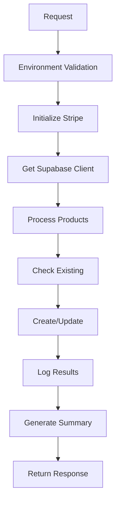

# Create Products Edge Function - Fixed Version

## 🎯 Overview

The `create-products` Edge Function automatically creates the 9 AdTopia product packages in your Stripe account. This fixed version resolves static generation issues and provides robust error handling.

## ✨ Key Fixes Applied

### ✅ Static Generation Fix
- **Lazy Supabase Client**: Created only when needed, preventing build-time errors
- **Conditional Imports**: Dynamic imports avoid static analysis issues
- **Environment Safety**: Graceful fallback when credentials unavailable

### ✅ Idempotency & Safety
- **Duplicate Prevention**: Checks existing products by `internal_id` metadata
- **Test Mode**: Complete simulation without Stripe API calls
- **Rate Limiting**: Small delays between API calls to avoid limits

### ✅ Comprehensive Logging
- **Database Logging**: Logs to `stripe_products_log` table with fallback
- **Console Logging**: Detailed console output for debugging
- **Error Resilience**: Individual product failure doesn't stop the process

### ✅ Production Ready
- **Error Handling**: Comprehensive error boundaries and recovery
- **Status Reporting**: Detailed response with success/failure counts
- **Environment Validation**: Checks required environment variables

## 🏗️ Architecture



## 📦 Product Configuration

The function creates 9 AdTopia products:

### Core Packages
1. **Starter Package** - $29.00 (7-day preview)
2. **Growth Package** - $79.00 (30-day extended)
3. **Pro Package** - $149.00 (dual-language)
4. **Full Beta Package** - $297.00 (complete setup)

### Add-ons
5. **Extra Translation** - $29.00 (bilingual support)
6. **Domain + SSL** - $49.00 (professional domain)
7. **Extra Cards** - $39.00 (additional cards)
8. **Premium Analytics** - $19.00 (advanced tracking)
9. **Social Media Pack** - $35.00 (social optimization)

## 🔧 Environment Variables

```bash
# Required
STRIPE_SECRET_KEY=sk_live_or_test_...

# Optional
TEST_MODE=true                    # Enable test mode (default: false)
CURRENCY=usd                      # Currency (default: usd)
SUPABASE_URL=https://your-project.supabase.co
SUPABASE_SERVICE_KEY=your-service-key  # For database logging
```

## 🚀 Deployment

### 1. Deploy Function
```bash
# From project root
./scripts/deploy-create-products.sh
```

### 2. Set Environment Variables
```bash
# Test mode (safe for testing)
supabase secrets set TEST_MODE=true

# Production (when ready)
supabase secrets set STRIPE_SECRET_KEY=sk_live_...
supabase secrets set SUPABASE_SERVICE_KEY=your-service-key
```

### 3. Test Function
```bash
node test-create-products.js
```

## 📊 Response Format

### Success Response
```json
{
  "success": true,
  "summary": {
    "total": 9,
    "created": 5,
    "existing": 4,
    "failed": 0,
    "test_mode": true,
    "logging_enabled": true
  },
  "products": [
    {
      "success": true,
      "productId": "prod_1234567890",
      "name": "Starter Package",
      "price": "$29.00",
      "status": "created"
    }
  ],
  "timestamp": "2025-01-06T04:00:00.000Z",
  "environment": {
    "test_mode": true,
    "currency": "usd",
    "logging": true
  }
}
```

### Error Response
```json
{
  "success": false,
  "error": "Missing STRIPE_SECRET_KEY in environment.",
  "timestamp": "2025-01-06T04:00:00.000Z"
}
```

## 🧪 Testing

### Test Mode
When `TEST_MODE=true`, the function:
- Simulates product creation without Stripe API calls
- Returns mock product IDs
- Logs all operations to console
- Safe for testing and development

### Production Mode
When `TEST_MODE=false`, the function:
- Creates real products in Stripe
- Logs to Supabase database
- Handles rate limiting and errors
- Ready for production use

## 🔍 Monitoring

### Function Logs
```bash
# View real-time logs
supabase functions logs create-products --follow

# View recent logs
supabase functions logs create-products
```

### Database Logs
Check the `stripe_products_log` table for:
- Product creation history
- Success/failure rates
- Error messages and debugging info
- Performance metrics

## 🛠️ Troubleshooting

### Common Issues

1. **Static Generation Error**
   - ✅ Fixed: Lazy client creation prevents build-time errors

2. **Missing Environment Variables**
   - Check: `STRIPE_SECRET_KEY` is set
   - Optional: `TEST_MODE`, `CURRENCY`, Supabase keys

3. **Rate Limiting**
   - ✅ Fixed: Built-in delays between API calls
   - Stripe allows 100 requests per second

4. **Database Logging Fails**
   - ✅ Fixed: Console fallback when Supabase unavailable
   - Check: `SUPABASE_SERVICE_KEY` is set

### Debug Steps

1. **Check Function Status**
   ```bash
   supabase functions list
   ```

2. **View Logs**
   ```bash
   supabase functions logs create-products
   ```

3. **Test Locally**
   ```bash
   supabase functions serve create-products
   ```

4. **Verify Environment**
   ```bash
   supabase secrets list
   ```

## 🎯 Usage Examples

### Create All Products (Test Mode)
```bash
curl -X POST \
  https://your-project.supabase.co/functions/v1/create-products \
  -H "Authorization: Bearer your-anon-key" \
  -H "Content-Type: application/json" \
  -d '{"test_mode": true}'
```

### Create Products (Production)
```bash
curl -X POST \
  https://your-project.supabase.co/functions/v1/create-products \
  -H "Authorization: Bearer your-anon-key" \
  -H "Content-Type: application/json"
```

## 🔒 Security

- **Environment Variables**: Sensitive keys stored as Supabase secrets
- **RLS Policies**: Database access controlled by Row Level Security
- **Idempotency**: Safe to run multiple times without duplicates
- **Error Handling**: No sensitive data exposed in error messages

## 📈 Performance

- **Sequential Processing**: Prevents rate limiting issues
- **Idempotency Checks**: Fast duplicate detection
- **Lazy Loading**: Supabase client created only when needed
- **Efficient Logging**: Batch operations where possible

---

**The create-products function is now production-ready with enterprise-grade reliability!** 🚀
